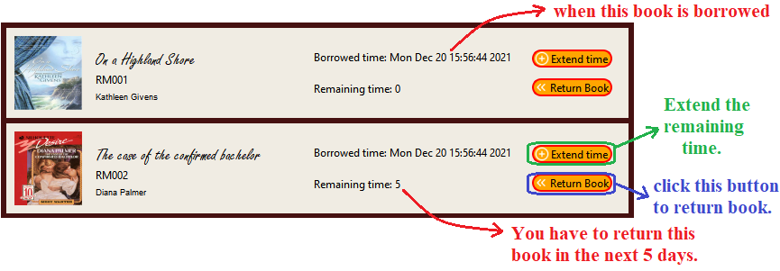

# Library Management app
<!-- 

  

 -->

**Content:**
<ul style="list-style-type: none">
    <li><a href="#about">About us</a></li>
    <li><a href="#set_up">Setup</a></li>
    <li><a href="#demo">UI and Functions</a></li>
</ul>

<h5 id="about"></h5>

## 1. About us
We will introduce briefly about our project:

+ This is our final project for the Object-Oriented Programming (OOP) course at HCMUS.
+ Our application provides users with several features that allow them to use the library's services. On the other hand, admins can also use this app to manage their library in a very simple way.

  
<!--  -->

### Contributors:

|   Student ID   |            Name               | Profile 
|----------------|-------------------------------|----------------------------
|    20120596    |Nguyen Bao Tin | [@nbtin](https://github.com/nbtin)            
|    20120607    |Le Huu Trong | [@huutrong2307](https://github.com/huutrong2307)           
|    20120609    |Nguyen Hoang Trung | [@hoangtrungnguyen1010](https://github.com/hoangtrungnguyen1010)

<h5 id="set_up"></h5>

## 2. Setup

We build this app with `Qt` and `C++` language.
* `Qt Creator` version `6.0.0` (Community).
* **Compiler**: `MSVC2019`.
* **OS**: Windows 10/11.

<h5 id="demo"></h5>

## 3. UI and Functions
First, make sure that you have an account (you can register an account or recover your password by clicking the buttons below). 

After logging in, this is the dashboard of our application.

This is an overview of the basic functionality of the application:

## Final Notes

**Thanks for going through this Repository! Have a nice day.**

Got any queries? Feel free to contact us via <a href = "mailto: baotin2402@gmail.com">E-mail</a>.